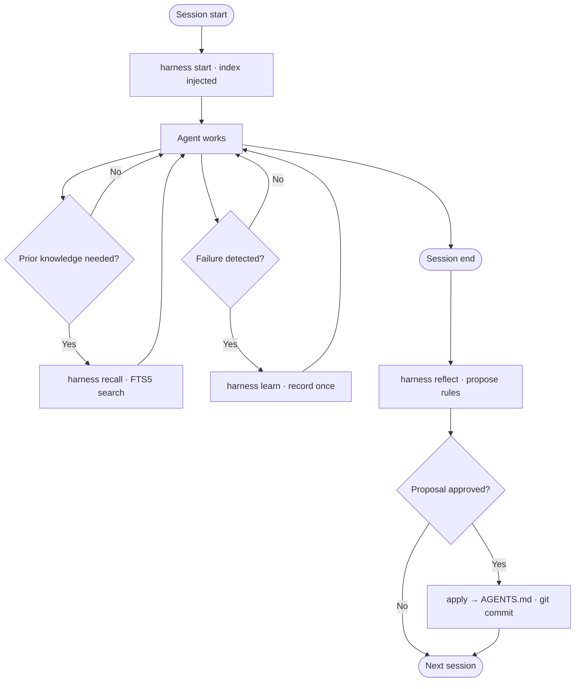
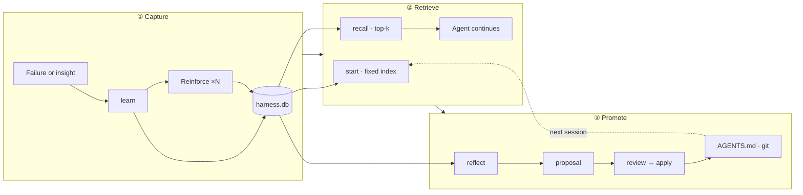
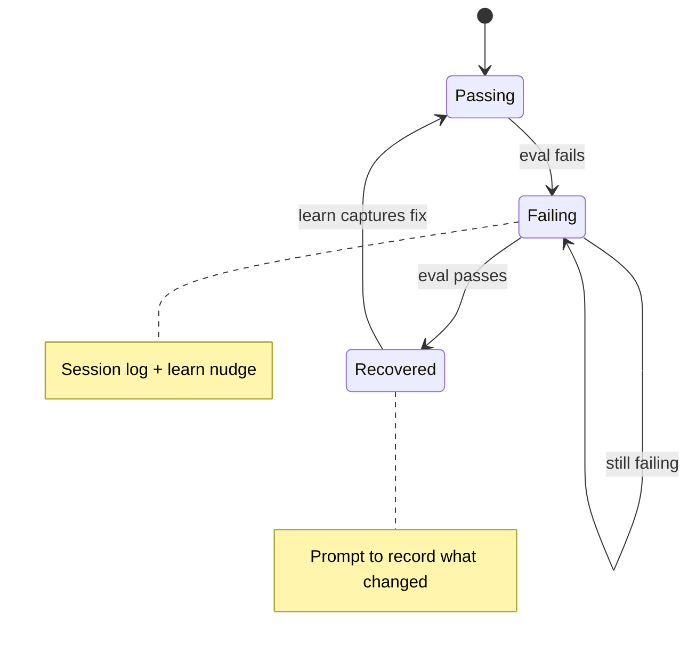

# Anneal

> **Annealing turns heat into strength. Anneal turns mistakes into memory.**

Open-source agent memory for **Cursor** and **Claude Code**. The `harness` CLI
captures mistakes once, recalls relevant lessons on demand, and promotes recurring
patterns into `AGENTS.md` — with your approval.

---

## Overview

Agents repeat the same mistakes because prior fixes live in lost context, not in the
repo. Anneal treats each failure as material to temper: record it once, retrieve it
when relevant, and graduate durable patterns into version-controlled rules.

Three responsibilities, one tool:

| Role | Commands | Responsibility |
| --- | --- | --- |
| **Wrapper** | `start`, `recall` | Bounded session context; on-demand retrieval |
| **Coach** | `learn`, `eval`, `watch` | Capture mistake + fix; reinforce repeats |
| **Gardener** | `reflect`, `review`, `apply`, `rollback` | Propose and apply durable rules (human-approved) |

### Session lifecycle

Hooks enforce the bookends; the agent calls `recall` and `learn` when work demands it.



### Knowledge compounding

Lessons accumulate in a local SQLite store. Retrieval stays selective — context size
does not scale with total lessons stored.



### Failure recovery

`eval` wraps your test command and detects the transition from failing to passing —
the signal that a lesson is worth keeping.



### Context economy

| Approach | Behavior | Cost |
| --- | --- | --- |
| Dump all memory at start | Every lesson in prompt | Grows without bound |
| **Anneal** | `start` = fixed index; `recall` = top-k on demand | Bounded per session |

Storage is SQLite + FTS5 today. The CLI contract is stable — backends can evolve
(e.g. embeddings) without changing how agents invoke the harness.

---

## Install

```bash
curl -fsSL https://github.com/KazzyAPI/anneal/releases/latest/download/install.sh | sh
```

Installs `harness` to `~/.local/bin`. Requires `bash`, `git`, `sqlite3` (FTS5),
and `curl` or `wget`.

```bash
cd your-repo
harness init      # scaffold .harness/ + AGENTS.md protocol
harness wire      # Cursor + Claude Code hooks
harness doctor    # verify setup
```

**In-repo install** (vendors `harness.sh` into the project):

```bash
curl -fsSL https://github.com/KazzyAPI/anneal/releases/latest/download/install.sh | sh -s -- --project
```

Pin or fork with `HARNESS_REMOTE`. Update later with `harness upgrade`.

---

## Quick start

```bash
harness start                         # lesson index (constant size)
harness recall "async tests"          # top relevant lessons only
# ... work; a test fails ...
harness learn \
  --title "Forgot await" \
  --fix "await before asserting" \
  --tags async,tests \
  --evidence "npm test"
harness reflect                       # propose durable rules
harness review && harness apply <id>  # approve → git commit
```

```bash
harness eval -- npm test   # tracks fail → pass recovery
```

---

## Enforcement

`AGENTS.md` is guidance. `harness wire` installs infrastructure that runs without
agent cooperation for key lifecycle steps:

| Layer | Trigger | Action |
| --- | --- | --- |
| Cursor `sessionStart` | Session open | `harness start` → index injected |
| Cursor `stop` | Session close | `harness reflect` |
| Cursor `postToolUse` (Shell) | Command fails | `learn` nudge injected |
| `.cursor/rules/harness-enforce.mdc` | Every turn | Protocol (`alwaysApply`) |
| Claude Code hooks | SessionStart / Stop | Same start / reflect cycle |

`recall` and `learn` still require the agent to act on injected context. Start,
reflect, and failure nudges are hook-guaranteed.

---

## State

Commit `.harness/` in projects using Anneal:

```
.harness/
  harness.db      # lessons + FTS5 index
  LEARNINGS.md    # generated digest
  config.sh       # DIGEST_LIMIT, RECALL_LIMIT, START_TOP
  proposals/      # pending reflect output
  applied/        # rollback markers
```

`sessions/`, WAL files, and other transient paths are gitignored.

---

## Commands

| Command | Purpose |
| --- | --- |
| `init` | Scaffold `.harness/` and add protocol to `AGENTS.md` |
| `wire` | Install Cursor + Claude Code enforcement hooks |
| `start` | Lesson index at session start |
| `recall <topic>` | Relevant lessons, ranked by match + reinforcement |
| `learn --title … --fix … [--problem …] [--tags …] [--evidence …]` | Record a lesson |
| `note <message>` | Log a session event |
| `watch -- <cmd>` | Run a command; log failure as learning candidate |
| `eval -- <cmd>` | Run tests; detect fail → pass recovery |
| `reflect` | Summarize session; write a proposal (not applied) |
| `review` | List pending proposals |
| `apply <id>` | Append approved proposal to `AGENTS.md` and git-commit |
| `rollback` | Revert the most recent applied proposal |
| `digest` | Regenerate `LEARNINGS.md` |
| `doctor` | Check environment and wiring |
| `upgrade` | Update `harness.sh` from `HARNESS_REMOTE` |
| `version` | Print installed version |

---

## Releases

Tags `v*` trigger GitHub Actions to bundle templates into a single `harness.sh`.
Release assets: [github.com/KazzyAPI/anneal/releases](https://github.com/KazzyAPI/anneal/releases).

---

## License

MIT — see [LICENSE](LICENSE).
